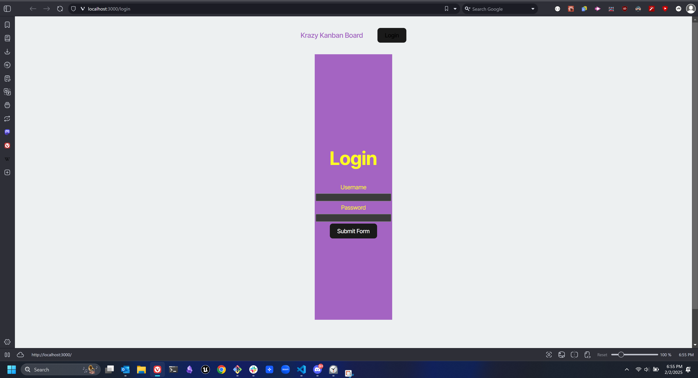
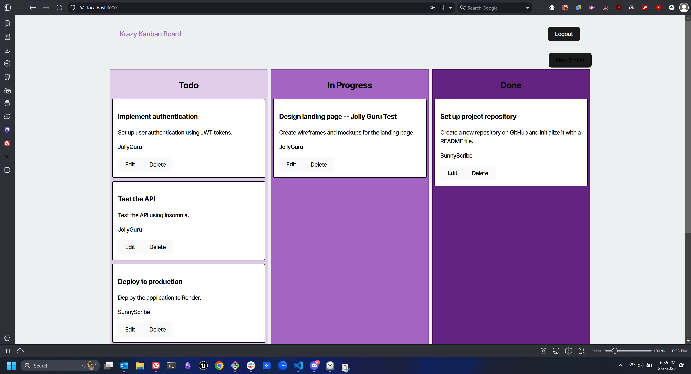

# Kanban with authentication

## Description

The point behind this assignment was to explore JWTs and making them work within the context of a finished application. The idea is to learn how an authorization system should work and hopefully acting as a springboard into making other application requiring authorization work properly.

## Installation

For a full "production" version, simply navigate to the render app. The link will be provided shortly.

If you're looking to download and play with what I've built, simply clone a copy of the code and then run `npm run start`

## Usage

The application itself is a Kanban. Login using either seed data or provide your own, though you will need to do this via a manual database entry.

Once you're in, you should be able to edit or delete the "cards" provided or create your own.

A minor note: In my mind, once the JWT has expired (5 minutes), the system should simply redirect you back to the login page. At present, that does not happen and will let you know that it has an "error fetching ticket". The manual work around for this is to click logout. This should return you to the login page and allow you to login again. When time permits, I intend to come back and resolve this bug as it's just not the best user experience.

## Credits

N/A

## License

No License
